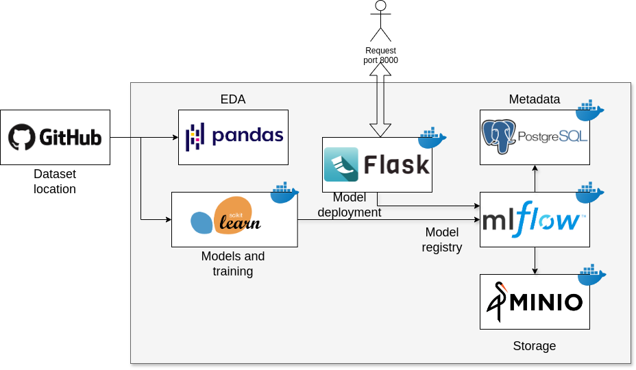

# House Price Predictor

This repository, jelambrar96-datatalks/house-price-predictor, appears to be a machine learning and deep learning project focused on predicting house prices. The repository likely contains code and data for training and testing models to forecast house prices based on various factors.

## 1. Problem Description

The price of a house depends on a wide range of variables, including its location, size, number of bedrooms, age, proximity to amenities, and even market conditions. Each of these factors interacts with others in complex ways. For example, a small house in a prime location may still be priced higher than a larger house in a less desirable area. Accounting for all these variables and their interactions to predict house prices accurately is an extremely challenging task when approached manually.

Trying to manually develop an algorithm to predict house prices by accounting for all these factors and their relationships can quickly become impractical and overwhelming. Manually developing an algorithm to incorporate and weigh these diverse factors would require an exhaustive amount of time, domain expertise, and effort. Not to mention, the relationships between these variables often involve nonlinear patterns, which are difficult to model with traditional rule-based approaches.

This complexity is precisely why machine learning becomes invaluable. Machine learning models are designed to learn from historical data, identifying patterns and relationships between variables without requiring explicit programming for each scenario. By leveraging these models, we can develop a predictive system that efficiently accounts for the wide array of factors influencing house prices, making accurate and scalable predictions possible.

## 2. Proposed solution

This is where machine learning provides an excellent solution. **Machine learning models** are designed to analyze vast datasets, uncover hidden patterns, and identify relationships between variables. By training a model with historical data on house prices and their associated features, we can build a system capable of making accurate predictions for new houses.

Here’s a structured solution to the house price prediction problem:  

### 2.1. **Proposed Solution for Predicting House Prices**  

To address the problem of predicting house prices effectively, we will follow a systematic approach that incorporates data exploration, model development, tracking, and deployment.  

#### **2.1.1. Exploratory Data Analysis (EDA)**  
**Objective**: Understand the dataset and uncover meaningful patterns and relationships.  
- **Data Cleaning**: Handle missing values, remove duplicates, and standardize data formats.  
- **Feature Understanding**: Analyze features such as location, size, number of bedrooms, age, and market conditions.  
- **Univariate Analysis**: Explore individual features to identify distributions, outliers, and trends.  
  - Example: Use histograms for price distribution or bar plots for categorical variables (e.g., number of bedrooms).  
- **Multivariate Analysis**: Analyze the relationships between features.  
  - Example: Correlation matrices and scatter plots to explore how size or location impacts price.  
- **Feature Engineering**:  
  - Create new features, such as price per square foot or proximity to city center.  
  - Encode categorical features (e.g., neighborhoods) using one-hot encoding or target encoding.  

#### **2.1.2. Train Multiple Machine Learning Models**  
**Objective**: Build and evaluate machine learning models to identify the best-performing algorithm.  
- **Data Splitting**: Divide the dataset into training, validation, and testing sets. 
- **Multiple Models**: Train and compare the performance of multiple models:   
- **Model Evaluation**: Use metric Mean Squared Error (MSE) to evaluate performance.  
- **Perform hyperparameter tuning** using techniques like Grid Search or Random Search with cross-validation to improve accuracy.  

#### **2.1.3. Model Registry with MLflow**  
**Objective**: Track experiments and manage models efficiently.  
- **Track Experiments**: Use MLflow to log training parameters, metrics, and artifacts for each model. Log hyperparameters, training/validation scores, and model artifacts (e.g., pickled model files).  
- **Model Registry**: Register the best-performing model in the MLflow Model Registry for easy retrieval. Assign stages such as *Staging*, *Production*, and *Archived* to manage model lifecycles.  

#### **2.1.4. Deploy the Model with Flask**  
**Objective**: Make the model available for real-world use via a REST API.This ensures the model is accessible to end-users via a lightweight and scalable API.  
- **Build API with Flask**:  
  - Create endpoints such as `/predict` to accept house feature data (e.g., size, location, age) as input.  
  - Load the best model from the MLflow registry and use it to generate predictions.  
- **Containerization**: Use Docker to containerize the Flask application for easy deployment.  

